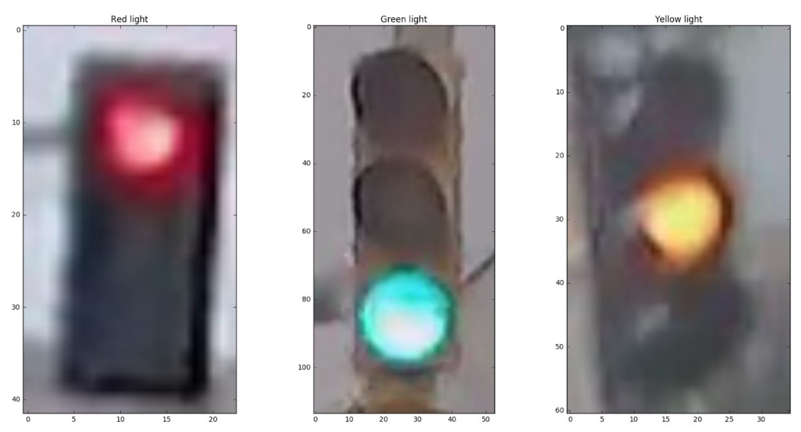

# Traffic Light Classifier

Udacity Intro to Self-Driving-Car Nanodegree

## Table of Contents
* [Project Summary](https://github.com/jurayev/intro-sdc-traffic-light-classifier-py#project-summary)
* [Dependencies](https://github.com/jurayev/intro-sdc-traffic-light-classifier-py#dependencies)
* [Getting Started](https://github.com/jurayev/intro-sdc-traffic-light-classifier-py#getting-started)
* [Dataset](https://github.com/jurayev/intro-sdc-traffic-light-classifier-py#dataset)
* [Pipeline](https://github.com/jurayev/intro-sdc-traffic-light-classifier-py#pipeline)
* [Tests](https://github.com/jurayev/intro-sdc-traffic-light-classifier-py#tests)
* [License](https://github.com/jurayev/intro-sdc-traffic-light-classifier-py#license)

## Project Summary

In this project I builded a classification pipeline that takes in an image of a traffic light, analysis it using computer vision and outputs a label that classifies the image as a: Red, Yellow, or Green illuminated traffic light.

Classification Pipeline includes:
1. [Loading and visualizing the data.](https://github.com/jurayev/intro-sdc-traffic-light-classifier-py#loading-and-visualizing-the-traffic-light-dataset)
2. [Pre-processing and standardazing the input images.](https://github.com/jurayev/intro-sdc-traffic-light-classifier-py#pre-process-the-data)
3. [Feature extraction.](https://github.com/jurayev/intro-sdc-traffic-light-classifier-py#feature-extraction)
4. [Classification of a model.](https://github.com/jurayev/intro-sdc-traffic-light-classifier-py#classification-of-a-model)
5. [Evaluation of the model.](https://github.com/jurayev/intro-sdc-traffic-light-classifier-py#evaluation-of-the-model)

## Dependencies
* Python 3.5 or higher.
* OpenCV (known as cv2 once downloaded) - `opencv-python` if installing from command line. Computer Vision library.
* matplotlib - plotting, visualization and image processing library.
* numpy - python data science library.

## Getting Started
1. Clone repository
```
$ git clone https://github.com/jurayev/intro-sdc-traffic-light-classifier-py
```
2. Navigate to project directory
```
$ cd intro-sdc-traffic-light-classifier-py
```
3. Run Classifier
```
$ python3 run.py
```

## Dataset
This traffic light dataset consists of 1484 number of color images in 3 categories - red, yellow, and green. As with most human-sourced data, the data is not evenly distributed among the types. There are:

- 904 red traffic light images
- 536 green traffic light images
- 44 yellow traffic light images

*Note: All images come from this [MIT self-driving car course](https://selfdrivingcars.mit.edu/) and are licensed under a [Creative Commons Attribution-ShareAlike 4.0 International License](https://creativecommons.org/licenses/by-sa/4.0/).*

Here are some sample images from the dataset (from left to right: red, green, and yellow traffic lights):


### Training and Testing Data

All 1484 of the traffic light images are separated into training and testing datasets. 

* 80% of these images are training images, used to train a classifier.
* 20% are test images, used to test the accuracy of a classifier.
* All images are pictures of 3-light traffic lights with one light illuminated.

## Pipeline
This section explains every pipeline step in details.

### 1. Loading and Visualizing the Traffic Light Dataset
Here we visualize and explore the image data. For that I created two functions:
1. `load_dataset(path)` helper function for loading a dataset from a specified directory.
2. `get_sorted_images_by_class(image)` that sorts out image by dedicated class among 3: red, yellow and green. And retruns sorted lists.
3. `show_images(image_one, image_two, image_three)` this one:
   * Displays passed images
   * Prints out the shape of the image 
   * Prints out its corresponding label
   

### 2. Pre-process the Data
After loading in each image, we have to standardize the input and output!

#### Standardize the input images¶
I created function `standardize_input(image)` that takes in an RGB image and return a new, standardized version:
* Resized image with desired dimension of 32x32px.
* Cropped resized version that would help us to extract features and evaluate image more precisely, also cropping significantly increases preformance of processing image arrays that is ***crucial when working with self-driving cars***.

Another pre-processing helper function is `one_hot_encode(label)` that label each image with ***one-hot encoding*** feature as binary vector, for example for yellow label value it would be `[0, 1, 0]`.

Output for standardized image list looks like:


### 3. Feature Extraction

I am using the knowledge about color spaces, shape analysis, and feature construction to create features that helps distinguish and classify the three types of traffic light images.

Here is a basic pipeline I am using in my classification model:


1. A masking feature.
   - Mask filter feature `create_mask_filter(image)` helps to get rid of bright, blurred, dark colors leaving only Red, Yellow, Green respectively.
   
2. A brightness feature.
   - Using HSV color space, I created a feature `create_brightness_feature(image)` that helps identify the 3 different classes of traffic light.
   - Brightness feature helps to extract a feature vector with brightness values for each of three traffic light classes. The highest value, the most probably the color is on.
Here is a visualization of HSV colorspace for red light image:

   

Based on this visualization I assume that S channel and V channel are most suitable to extract the brightness feature, however based on experimental visualization and training of many images it is clear that Saturation doesn't work well for most of the images and I should proceed with Value channel.

These features will be combined to form a complete classification algorithm that outputs 100% accuracy in a combination only.

### 4. Classification of a model

Using all of my features, I wrote a function that takes in an RGB image and, using the extracted features, outputs whether a light is red, green or yellow as a one-hot encoded label. This classification function is be able to classify any image of a traffic light!

`estimate_label(image)` - takes in RGB image input. Analyzes the image using feature extraction code and output a one-hot encoded label.

### 5. Evaluation of the model.
Determining the Accuracy is the main part of classification model. Compare the output of a classification algorithm with the true labels and determine the accuracy. 
`get_misclassified_images(test_images)` - this code stores all the misclassified images, their predicted labels, and their true labels, in a list.

The results of classification of test images dataset are below:
```
$ Accuracy: 1.0
$ Number of misclassified images = 0 out of 297
```

The 100% accuracy is achieved by properly standardizing images, masking them and exatracting the brightness feature. Sometimes input images are fully black out with masking filter due to low-quality of the input image and predictions made are wrong. To avoid that I programmed my algorith to check that and use non-masked image copy for evaluation.

## Tests
Once I evaluated the results, also it must be true that:
1. One hot encode function works properly.
2. Never classify a red light as a green light.

Unit tests results are:
```
$ TEST PASSED
The `one_hot_encode` function works as expected!
$ TEST PASSED
No misclassified Red images are classified as Green!
```

## License
The content of this repository is licensed under a [MIT License](https://github.com/jurayev/intro-sdc-traffic-light-classifier-py/blob/master/LICENSE.md).
